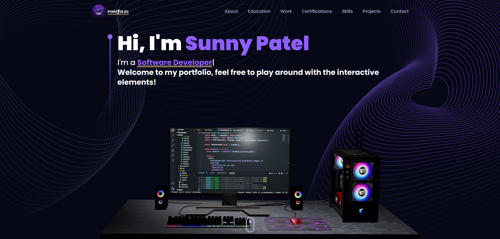

# 3D Portfolio README 🚀

Welcome to the 3D Portfolio project! 🎉 This repository hosts a fully functional portfolio website designed with React.js and Three.js. It offers an immersive experience to showcase your skills and projects in a visually appealing manner.

## Overview ℹ️

The 3D Portfolio is a modern and interactive web application built with React.js and Three.js, hosted on Vercel with Next.js. It offers a visually stunning platform to showcase your skills and projects, featuring smooth animations and responsive design.

## Live Demo 💻

Explore the live demonstration of the project at [www.sunnypatel.net](www.sunnypatel.net)!

## Usage 🛠️

Feel free to explore the codebase and use it as a reference for building your own interactive portfolio or web application. The project demonstrates how to leverage React.js and Three.js to create visually stunning and interactive experiences on the web.

## Features ✨

- **Interactive Visuals**: Engage your audience with captivating Three.js animations and visuals.
- **Responsive Design**: Ensure your portfolio looks great on all devices with the help of Tailwind CSS.
- **Dynamic Content**: Use React.js to easily manage and render dynamic content sections.
- **Smooth Transitions**: Enhance user experience with smooth transitions and animations powered by Framer Motion.
- **Customizable**: Tailor the portfolio to your needs with easy-to-understand code and styling.

## Deployment 🌐

This project is deployed on Vercel using Next.js. It dynamically hides environment variables, such as emailJS configuration, to ensure security. You can access the deployed project at [www.sunnypatel.net](www.sunnypatel.net).

## Built with Vite 🚀

This project was developed using Vite, a blazing fast build tool for modern web development, created by the same team behind Vue.js. With its lightning-fast hot module replacement and optimized bundling, Vite provides a smooth development experience, making it an excellent choice for building high-performance web applications.

## Acknowledgements 🙏

Special thanks to the creators and maintainers of the following libraries and tools that made this project possible:

- React.js
- Three.js
- Tailwind CSS
- Framer Motion
- Maath
- EmailJS
- ESLint
- Prettier
- Vercel

## License 📝

This project is open source and licensed under the Sunny Patel License. See the `LICENSE` file for more details.

## Need Help? 🤔

If you have any questions or need assistance, feel free to reach out to me at sunnypatel124555@gmail.com. I'm here to help! 🌞

## GitHub Stars ⭐

